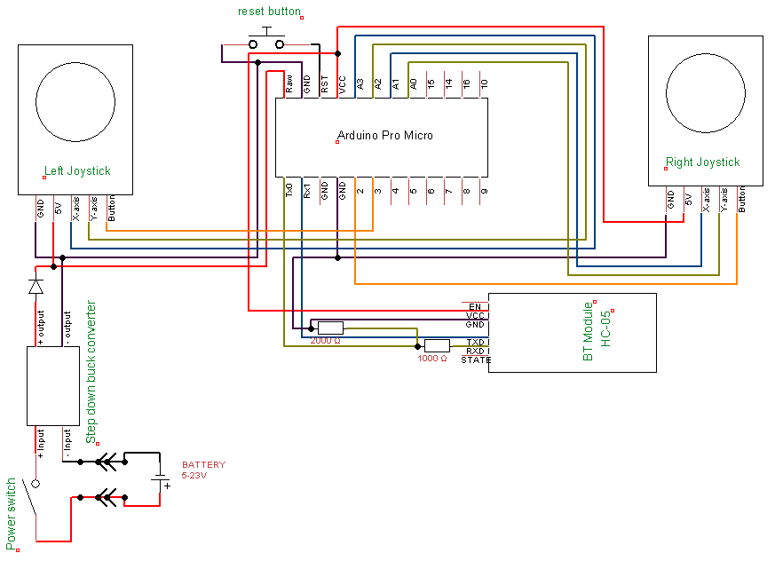

# Arduiono bluetooth controller

A bluetooth controller made with 2 joyticks with built in buttons, it has no telemtry.

## Main components
- HC-05(Bluetooth module), see [Datasheet](docs/datasheet_hc-05.pdf), [manual](docs/manual_hc-05.pdf)
- Arduino pro micro, see [Pin out](docs/pin_out_arduino.pdf)
  - Almost every ardouno works with atleast 4 digitla pins and 4 analog. May need to change board varible from micro platformio.ini file.)
- two 2 axis Joysticks with built in buttoons, see [Manual](docs/manual_joystick.pdf)
- Power source/Battery (5V or higher)
  - **If the power source voltage is higher then 5V.**
    - Tiny Buck converter, see [Datasheet](docs/stepdown_buck_conveter.md)
### Simpler components
#### Nessesary
- Resistors
  - 1000 ohm
  - 2000 ohm
#### Not nessesary
- Button, see [technical drawing](docs/technical_drawing_button.jpg)
  - normaly closed
- Switch, see [datasheet](docs/datasheet_switch.pdf)
  - two position switch
- Diode
  - min volt: 5V
  - min amp: 3A

## Signal output
The signal from the controller will never be sent faster then 20 times a seconds(50ms delay).
The signal will always be sent in this order:
  - Right x-axis
  - Right y-axis
  - Right Button
  - Left x-axis
  - Left y-axis
  - Left button

All joysticks will send an output between 1-3 or 1-4 numbers, betwine 0-100, 0-1000 or 1000-2000 (depending on what joystick output mode).While the buttons2 numbers betwine 0-1

## Settings
### Settings general info
- All settings are set with the id of the option.
#### Joystick output mode
- joystick output mode changes what number is low and high, the output is sent as RC-signal(0, 1000-2000), low_RC-signal(1, 0-1000) or Procent(2, 0 - 100).
- (id(code setting nummber), output betwine x-y)

### Button inversion
- Inverts the normal and pressed output state of the buttons
- Button_inversion = 0 means that buttons will regester 0 normaly and 1 when pressed

### Buttons activation
- Activating or deactivating the buttons so they don't output the button signal.
- The right and left button can be deactivated and activated induvidualy.
- If the buttons are not conneted they can be turned off to lower the latency of the signal.

### Standard settings
- Joystick_output_mode = 0
- Button_inversion = 0
- Button_active_right = 0
- Button_active_left = 0

## Blueprint and building inforamtion
### Generall informatioon
The controller is made up of a few parts, meant to be put together with M3 bolts and M3 thread inserts. It is made up of 2 main parts that are connected with a cable with 5 wires in. In the left conntroller thear should be a battery, batttery switch, stepdown buck converter, diode and a joystick, while in the right controller thear should be an arduino, button(normaly closed), Bluetooth module (Able to be set as master, abel to send info and not only recive), joystick and two resistors(one 1000 ohm and one 2000 ohm).

### Electrical schematic
The electrical schematic can be devided in mto two parts teh right controller and teh left controller, witch are conected with 5 cables (5V, GND, left x-axis, left y-axis and left button)

### Body/Chassi to the conttroller
The controllers was inspierd by the nintendo Wii nunchuk's. The right side has a hole for a small button in the bottom plate for the reset button, while the left bottom plate has a slot for a 2 posotion switch to turn of the power to the conntroller. This is the Thingiverse [Link](https://www.thingiverse.com/thing:4665958) to the lates virsion of the stl and f3d files to print or customize the controllers, all the original stl and f3d filles are available in docs/chassi/

## Config for the bluetooth module
To get the bluetooth module you will have to config it to binded to the right bluetooth module/reciver.
